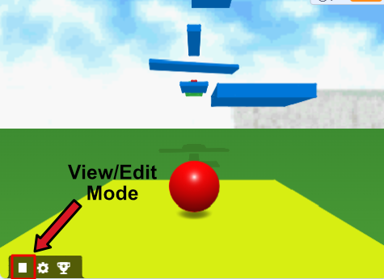

# Intro

## The plan

In this tutorial we're going to make a simple platformer using ChromeEngine. 
Here's a sketch of what we'll be making:

We'll be using ChromeEngine for this tutorial. To get an empty version of ChromeEngine that you can use for the tutorial all you need to do is remix [this project](https://scratch.mit.edu/projects/868415101/)

## ChromeEngine's Layout

Before you begin using ChromeEngine, it's helpful to know a little bit about it's layout. It's not complicated but it's important you're familiar with it or you might get stuck right out of the gate. ChromeEngine contains many sprites but you only need to care about 4 of them: `Setup`, `Logic`, `GUI`, `Settings`.

### Code Locations
Additionally within those 4 sprites you MUST place your code within the designated blocks for user code. If in doubt please refer to the following table for all user code locations:

| Step in development    | Sprite name | Code block(s) to use
| ----------- | ----------- | ----------- | 
| Setting up your game scene     | `Setup`      | `setup scene objects`       |
| Adding logic that makes objects in your game move and interactive   |   `Logic`      | `GameObjects.setup`, `Play Logic`, `Edit Logic`, `Play and Edit Logic`|
| Making your game's GUI | `GUI` | `Game GUI` |
| Changing the engines global settings | `Settings` | `When Green Flag clicked` |

### Sounds, Texture and Skybox Locations

- Sounds: Should be placed within the `Logic` sprite.
- Textures: Should be placed within the `Render` sprite.
- Skybox: In `Render` modify `skybox_day`, `skybox_night` and `ground` costumes

## View Mode and Edit Mode

In Chrome Engine, your game will by default load into `Play mode` but when making the scene it is crucial that you can look at what you're making. To do this you need to click the little square button in the bottom left corner of the screen. This button swaps you from `Play Mode` to `Edit mode`. In `Edit mode` you can fly around your scene using `WASD` for movement, arrow keys or mouse for rotating the view, and `Q` and `E` for vertical movement.

All images in the tutorial are taken by first swapping to edit mode, then flying out to a point which lets us capture the best view.

## Disabling shadows for more speed

If your computer is on the slow side, then this tutorial is probably going to be laggy. To make your game run faster you might want to consider disabling shadows as this makes it about 30-40% faster. You can do this by going to the `Settings` sprite and changing the first setting called `@shadows?`:

<ScratchBlocks>
{`
set [@shadows? v] to [0]
`}
</ScratchBlocks>

## Ready, set, go!
So, are you ready to embark on this exciting adventure of creating your very own platformer game? Let's jump right into it and start crafting an immersive world of platforms and challenges! 🎮🌟