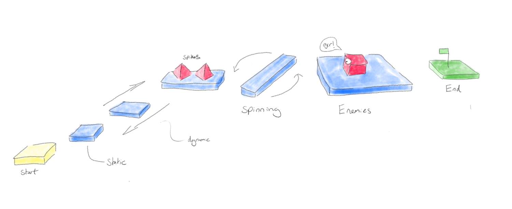

# Intro

## The plan

In this tutorial we're going make a simple platformer using ChromeEngine. 
Here's a sketch of what we'll be making:

We'll be using ChromeEngine for this tutorial. To get an empty version of ChromeEngine that you can use for the tutorial all you need to do is remix [this project](https://scratch.mit.edu/projects/714869495/)

## ChromeEngine's Layout

Before you begin using ChromeEngine it's helpful to know a little bit about it's layout. It's not complicated but it's important you're familiar with it or you might get stuck right out of the gate. ChromeEngine contains many sprites but you only need to care about 4 of them: `Setup`, `Logic`, `GUI`, `Settings`.

### Code Locations
Additionally within those 4 sprites you MUST place your code within the designated blocks for user code. If in doubt please refer to the following table for all user code locations:

| Step in development    | Sprite name | Code block(s) to use
| ----------- | ----------- | ----------- | 
| Setting up your game scene     | `Setup`      | `setup scene objects`       |
| Adding logic that makes objects in your game move and interactive   |   `Logic`      | `GameObjects.setup`, `Play Logic`, `Edit Logic`, `Play and Edit Logic`|
| Making your game's GUI | `GUI` | `Game GUI` |
| Changing the engines global settings | `Settings` | `When Green Flag clicked` |

### Sounds, Texture and Skybox Locations

- Sounds: Should be placed within the `Logic` sprite.
- Textures: Should be placed within the `Render` sprite.
- Skybox: In `Render` modify `skybox_day`, `skybox_night` and `ground` costumes

## Ready, set, go!
So, are you ready to embark on this exciting adventure of creating your very own platformer game? Let's jump right into it and start crafting an immersive world of platforms and challenges! 🎮🌟