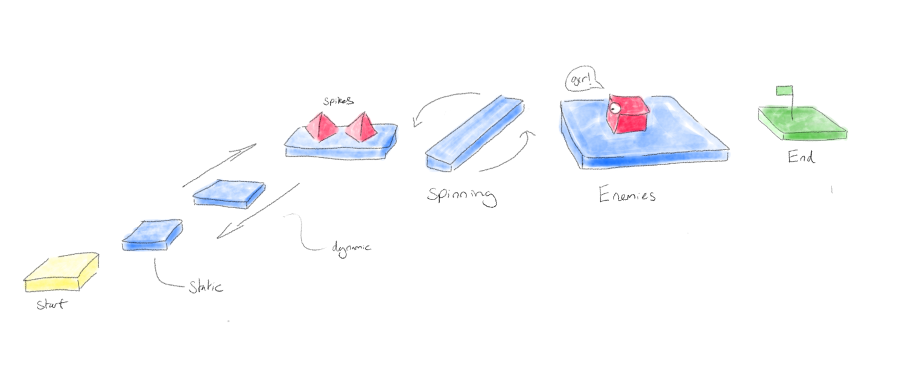

# Modelling the Game Scene
Normally modelling a game scene could take a while but in ChromeEngine it's super Easy! Once again here's the scene we're going to be making:

It has a start and end platform, 5 in between platforms, two spikes and an enemy. 

In ChromeEngine, all code for modelling the scene should be placed in the aptly named sprite `Setup` within the custom block `setup scene objects` . We're going to do all our modelling via code which is nice and easy for our simple platformer, however we recommend you use 3D modelling software like Blender for bigger game scenes as it'll make your life alot easier. To see how to do that go [here](/docs/tutorials/Modelling%20with%20Blender/Modelling-with-blender)

## First add a player

The first step in any ChromeEngine project should be to make sure you have a player as otherwise we won't be able to play the game! If you're using the blank ChromeEngine project then by default we create a player object. If you don't have one then in the `setup scene objects` custom block add the following

<ScratchBlocks>
{`
GameObjects.createPlayer \\( position [0] [1] [0] first person view? <> Fixed shadow? <not <>>\\) :: custom
`}
</ScratchBlocks>

This sets our players initial position to be `0,1,0` (aka 1 unit above the origin) and tells ChromeEngine that we want our player to have a shadow which stays at a fixed distance. The fixed distance shadow is important when making a platformer, as otherwise ChromeEngine will project the shadow onto the ground plane, which won't look very good.

## Adding colour using materials

In order to tell ChromeEngine what colour we want each of the objects in our scene to be we need to use `Materials`. In ChromeEngine we can make a new material using the following block:

<ScratchBlocks>
{`
Materials.newMaterial \\(label [] pointer to secondary colour material [ ] sfx sound name [ ] texture costume name [ ] Colour \\(R,G,B,A\\) [] no collider? [ ] bounciness \\(0-1\\) [ ]) :: custom
`}
</ScratchBlocks>

For our purposes the only input we care about is the Colour input and Label input. 
- **Label** - the name of the material. This MUST be specified or you won't be able to use the material later.
- **Colour** - This is where we specify what colour we want our object or primitive to have. We input colours as comma seperated RGBA value. E.g for Red we input 255,0,0,1. If you leave out the A component, and just input the RGB E.g 255,0,0 ChromeEngine will assume an alpha (transparency) of 1. In most cases we will only input the RGB as we rarely need our materials to have transparency.

We'll be making yellow, blue, and green platforms aswell as red enemies and spikes so lets make one material for each of these 4 colours. Here's the specific code we'll use for this:

 <ScratchBlocks>
{`
Materials.newMaterial \\(label [Yellow] pointer to secondary colour material [ ] sfx sound name [ ] texture costume name [ ] Colour \\(R,G,B,A\\) [230,255,20] no collider? [ ] bounciness \\(0-1\\) [ ]) :: custom
Materials.newMaterial \\(label [Green] pointer to secondary colour material [ ] sfx sound name [ ] texture costume name [ ] Colour \\(R,G,B,A\\) [0,255,0 ] no collider? [ ] bounciness \\(0-1\\) [ ]) :: custom
Materials.newMaterial \\(label [Blue] pointer to secondary colour material [ ] sfx sound name [ ] texture costume name [ ] Colour \\(R,G,B,A\\) [0,140,255] no collider? [ ] bounciness \\(0-1\\) [ ]) :: custom
Materials.newMaterial \\(label [Red] pointer to secondary colour material [ ] sfx sound name [ ] texture costume name [ ] Colour \\(R,G,B,A\\) [255,0,0] no collider? [ ] bounciness \\(0-1\\) [ ]) :: custom
`}
</ScratchBlocks>

## Coordinate System in ChromeEngine

The coordinate system used by ChromeEngine is based on the system used by OpenGL. It is a right-handed system, which means that:

- The x-axis goes from left (negative values) to right (positive values).
- The y-axis goes from bottom (negative values) to top (positive values).
- The z-axis goes from far (negative values) to near (positive values).

This is important to understand when setting positions of your game objects.

## Making the platforms with `createCuboid`

We're going to try to make some platforms which match the drawing at the top of this page. For this we're going to use the `createCuboid` block:
<ScratchBlocks>
{`
GameObjects.createCuboid \\(Scale [ ] [ ] [ ] Position [ ] [ ] [ ] Rotation [ ] [ ] [ ] Material [ ] name [ ]\\) :: custom
`}
</ScratchBlocks>

This lets us specify Scale, Position and one of our previously create materials. ChromeEngine doesn't have a visual scene modelling environment, so for find the right Scale and Position values for our platforms we apply trial and error. (For more complex scenes we recommend you model your scene in Blender, which you can learn how to do with our [Blender Modelling tutorial](/docs/tutorials/Modelling%20with%20Blender/Modelling-with-blender))

We encourage you to try and see if you can make these platforms on your own, but if you get stuck you can just copy the below code.

<ScratchBlocks>
{`
GameObjects.createCuboid \\(Scale [2] [0.2] [2] Position [0] [0] [0] Rotation [ ] [ ] [ ] Material [Yellow] name [Start]\\) :: custom
GameObjects.createCuboid \\(Scale [1.6] [0.2] [1.2] Position [1.2] [1.4] [-2.5] Rotation [ ] [ ] [ ] Material [Blue] name [Platform 2]\\) :: custom
GameObjects.createCuboid \\(Scale [1.2] [0.2] [1.2] Position [0.6] [3.6] [-5.2] Rotation [ ] [ ] [ ] Material [Blue] name [Platform 3]\\) :: custom
GameObjects.createCuboid \\(Scale [0.5] [0.2] [3] Position [0] [5.2] [-9.2] Rotation [ ] [ ] [ ] Material [Blue] name [Platform 4]\\) :: custom
GameObjects.createCuboid \\(Scale [1.3] [0.2] [6.4] Position [0] [5.6] [-14.6] Rotation [ ] [ ] [ ] Material [Blue] name [Platform 5]\\) :: custom
GameObjects.createCuboid \\(Scale [2.4] [0.2] [3.4] Position [0] [5.2] [-20] Rotation [ ] [ ] [ ] Material [Blue] name [Platform 6]\\) :: custom
GameObjects.createCuboid \\(Scale [1.3] [0.2] [6.4] Position [0] [5.6] [-14.6] Rotation [ ] [ ] [ ] Material [Green] name [End]\\) :: custom
`}

</ScratchBlocks>

Now when we click play we get our first look at our 3D platformer!

## Modelling the spikes using `createCone`

For our spikes, we'll use a cone mesh, with 4 sides. In ChromeEngine to add a cone shaped GameObject we use the `GameObjects.createCone` block:

<ScratchBlocks>
{`
GameObjects.createCone \\(Radius [] Height [] Number of sides [] Position [ ] [ ] [ ] Rotation [ ] [ ] [ ] Material [ ] name [ ]\\) :: custom
`}
</ScratchBlocks>

To make our spikes we'll use two of these each with Radius 0.2, height 0.3 and 4 sides. We'll assign them both the `Red` material. Make sure that your cones are positioned above the platformer and don't intersect with it.

<ScratchBlocks>
{`
GameObjects.createCone \\(Radius [0.2] Height [0.3] Number of sides [4] Position [0] [5.3] [-8.6] Rotation [ ] [ ] [ ] Material [Red] name [Spike 1]\\) :: custom
GameObjects.createCone \\(Radius [0.2] Height [0.3] Number of sides [4] Position [0] [5.3] [-9.8] Rotation [ ] [ ] [ ] Material [Red] name [Spike 2]\\) :: custom
`}
</ScratchBlocks>

Here's what our spikes should look like:

## Modelling our Enemy

### Modelling the enemies body using `createCuboid`
For our enemies body we'll once again use the `GameObjects.createCuboid` block:

<ScratchBlocks>
{`
GameObjects.createCuboid \\(Scale [0.4] [0.4] [0.4] Position [0] [5.6] [-20] Rotation [ ] [ ] [ ] Material [Red] name [Enemy]\\) :: custom
`}
</ScratchBlocks>

### Giving our enemy an eye using `create3DPoint`

Our Enemy's a little boring at the moment so lets bring it to life by giving it an eye! We can do this easily in ChromeEngine using 3D points which are points in 3D space either rendered as a dot with pen or as a stamped image. In our case lets use a stamped image, because then we can make our eye more complex.

We'll be using the following image for the eye.

Save this to your computer, then import it as a costume in the `Render` sprite, and rename to `Eye`.

To use this as a texture we need to create a material using it. We do this in the same way that we created a Colour Material but this time we need to set the `texture costume name` input to `Eye`

 <ScratchBlocks>
{`
Materials.newMaterial \\(label [Eye] pointer to secondary colour material [ ] sfx sound name [ ] texture costume name [Eye] Colour \\(R,G,B,A\\) [] no collider? [ ] bounciness \\(0-1\\) [ ]) :: custom
`}
</ScratchBlocks>

We can then create the eye using the `GameObjects.create3DPoint` block:

<ScratchBlocks>
{`
GameObjects.create3DPoint \\(material name [Eye] radius [0.2] scale y [] position [0] [0] [-0.3] parent [enemy] shadow offset dist [] name [Eye]) :: custom
`}
</ScratchBlocks>

We set the set the material to the `Eye` material we made earlier. To make sure our `Eye` is always at a fixed offset from the Enemy body we parent it to the Enemy and specify the position as an offset of `0, 0, -0.3` rather than a global coordinate.  parent it `Enemy`,  and set it to being rendered with a stamped costume rather than the pen.

Here's what our finished enemy should look like:

## Modelling the flag

### Modelling the flag pole using `create3DLine`

Our flag pole is a vertical cylinder of height 0.9. In ChromeEngine to improve the performance we use 3D lines instead of cylinders. To make a 3D line we use the `GameObjects.create3DLine` block. Here's how we can use it to make a flag pole in the centre of our final platform:

<ScratchBlocks>
{`
GameObjects.create3DLine \\(Pt A [0] [5.2] [-23] Pt B [0] [6.4] [-23] material [Yellow] radius [0.02] parent [] name [Flag Pole]\\) :: custom
`}
</ScratchBlocks>

Points A and B are the end points of our 3D line and Radius is the thickness of it.

### Modelling the flag fabric using `createTri/Quad`

On top of our flag pole we want a single green rectangle for the flag fabric. To make a single triangle or quad in ChromeEngine you can use the `createTri/Quad` block. Here's how it can be used for to make the flag fabric:

<ScratchBlocks>
{`
GameObjects.createTri/Quad \\(Pt A [0] [6.1] [-23] Pt B [0] [6.4] [-23] Pt C [-0.5] [6.4] [-23] Pt D \\(leave blank if tri\\) [-0.5] [6.1] [-23] parent [Flag Pole] material [Flag] name [Flag Fabric]\\) :: custom
`}
</ScratchBlocks>

### Finishing the Flag using `setDoubleSided`

By default in Chrome Engine all primitives are single sided, meaning they are invisible if viewed from the back, however we don't want this for our flag so we need to change this. In ChromeEngine we can use the `Materials.setDoubleSided` block to create materials which force primitives to be double sided. First we make a new material for our flag and then we make it a double sided material using `Materials.setDoubleSided`:

<ScratchBlocks>
{`
Materials.newMaterial \\(label [Flag] pointer to secondary colour material [ ] sfx sound name [ ] texture costume name [ ] Colour \\(R,G,B,A\\) [0,255,0] no collider? [ ] bounciness \\(0-1\\) [ ]) :: custom
Materials.setDoubleSided \\( [Flag] \\):: custom
`}
</ScratchBlocks>

Finally here's our finished flag!

## Wrapping up and Additional Resources

Congratulations! If you did all the steps correctly, you should now have something that looks a bit like this when you click the green flag:

Here's the finished code you should have after completing the `Setting the Scene` tutorial stage.

For more detailed information on setting up the scene in ChromeEngine, you can visit [Creating The Scene](/docs/user_docs/Modelling) in our documentation.

In the next part of this tutorial, we'll add movement and interaction to our game! Keep learning, and happy coding!

