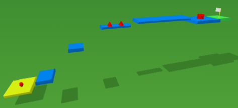
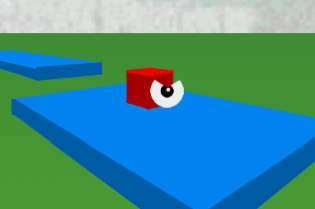
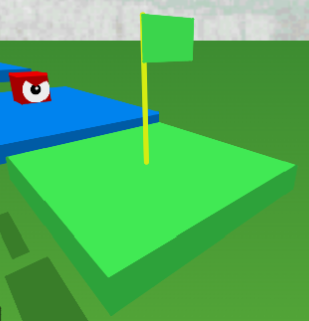
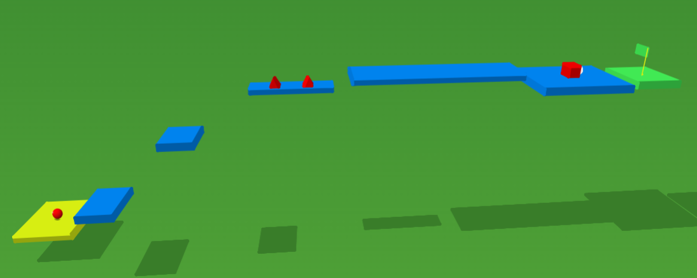
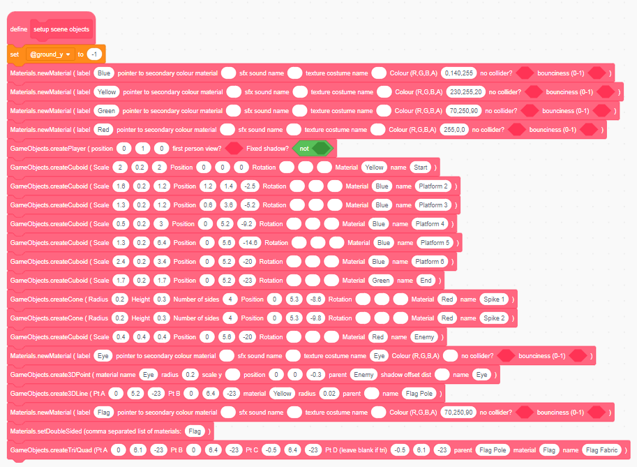

# Adding Materials

We've modelled the geometry of our game scene now it's time to bring it to life by adding colours and images using materials!

## The `newMaterial` block 

In order to tell ChromeEngine what colour we want each of the objects in our scene to be we need to use `Materials`. In ChromeEngine we can make a new material using the `newMaterial` block:

<ScratchBlocks>
{`
Materials.newMaterial \\(label [] pointer to secondary colour material [ ] sfx sound name [ ] texture costume name [ ] Colour \\(R,G,B,A\\) [] no collider? [ ] bounciness \\(0-1\\) [ ]) :: custom
`}
</ScratchBlocks>

For the purposes of this tutorial we only care about the inputs `label`, `sfx sound name`, `texture costume name` and `colour` but you can find out more about the other inputs [here](/docs/user_docs/Materials)
- **label** - what we will use to refer to this material in future
- **sfx sound name** - the name of a sound file in the `Logic` sprite which will be played when a player walks on a primitive with this material.
- **texture costume name** - the name of a texture contained as a costume in the sprite `render`. If specified ChromeEngine will use a texture for this primitive.
- **Colour** - the colour separated RGBA value for the primitive. If you don't specify `texture costume name` you'll need to specify this or your material won't have a colour and will default to black. You can leave out the A component, and the colour will default to an alpha of 1.

This block must be placed **BEFORE** we create a GameObject using it.

## Creating solid colour materials
We'll be making **yellow**, **blue**, and **green** platforms aswell as **red** enemies and spikes so lets make one material for each of these 4 colours using `newMaterial`. The RGB colours for each Material which we will enter into the `Colour` input of the block will be as follows:

- **Yellow**: `230,255,20`
- **Blue**: `0,140,255`
- **Green**: `0,255,0 `
- **Red**: `255,0,0`

We place these blocks right at the start of the `setup scene objects` block. Here's the specific code we'll use for this:

 <ScratchBlocks>
{`
define setup scene objects
Materials.newMaterial \\(label [Yellow] pointer to secondary colour material [ ] sfx sound name [ ] texture costume name [ ] Colour \\(R,G,B,A\\) [230,255,20] no collider? [ ] bounciness \\(0-1\\) [ ]) :: custom
Materials.newMaterial \\(label [Green] pointer to secondary colour material [ ] sfx sound name [ ] texture costume name [ ] Colour \\(R,G,B,A\\) [0,255,0 ] no collider? [ ] bounciness \\(0-1\\) [ ]) :: custom
Materials.newMaterial \\(label [Blue] pointer to secondary colour material [ ] sfx sound name [ ] texture costume name [ ] Colour \\(R,G,B,A\\) [0,140,255] no collider? [ ] bounciness \\(0-1\\) [ ]) :: custom
Materials.newMaterial \\(label [Red] pointer to secondary colour material [ ] sfx sound name [ ] texture costume name [ ] Colour \\(R,G,B,A\\) [255,0,0] no collider? [ ] bounciness \\(0-1\\) [ ]) :: custom
`}
</ScratchBlocks>

To assign a specific material to a GameObject, just insert that materials label in the `Material` input of slot when creating the GameObject. E.g to make the `Start` Platform use the material `Yellow` we do:
<ScratchBlocks>
{`
GameObjects.createCuboid \\(Scale [2] [0.2] [2] Position [0] [0] [0] Rotation [ ] [ ] [ ] Material [Yellow] name [Start]\\) :: custom
`}
</ScratchBlocks>

We'll assign the following materials in the scene:

- **Yellow**: `Start`, `Flag Pole`
- **Blue**: `Platform 2`, `Platform 3`, `Platform 4`, `Platform 5`, `Platform 6`
- **Green**: `End`
- **Red**: `Spike 1`, `Spike 2`, `Enemy`

Our scene is now looking much more colourful!

## Making the Enemy's eye using textured materials

Previously we created our Enemy's eye but we didn't assign it a material! Lets make it use a stamped image of a picture of an eye because then we can make it more expressive than a single pen dot. We'll be using the following image for the eye.

Save this to your computer, then import it as a costume in the `Render` sprite, and rename to `Eye`.

To use this as a texture we need to create a material using it. We do this in the same way that we created a Colour Material but this time we need to set the `texture costume name` input to `Eye`

 <ScratchBlocks>
{`
Materials.newMaterial \\(label [Eye] pointer to secondary colour material [ ] sfx sound name [ ] texture costume name [Eye] Colour \\(R,G,B,A\\) [] no collider? [ ] bounciness \\(0-1\\) [ ]) :: custom
`}
</ScratchBlocks>

We place this block before we call `create3DPoint` and assign the material to the 3D point by inserting `Eye` in the material slot of the block like this:

 <ScratchBlocks>
{`
Materials.newMaterial \\(label [Eye] pointer to secondary colour material [ ] sfx sound name [ ] texture costume name [Eye] Colour \\(R,G,B,A\\) [] no collider? [ ] bounciness \\(0-1\\) [ ]) :: custom
GameObjects.create3DPoint \\(material name [Eye] radius [0.2] scale y [] position [0] [0] [-0.3] parent [enemy] shadow offset dist [] name [Eye]) :: custom
`}
</ScratchBlocks>

Here's what our Enemy and their new and improved eye should look like:

## Finishing the Flag with `setDoubleSided`

So far everything in our scene has been assigned a material except for the flag. This isn't because we've forgotten the flag but because we need to give our flag it's own special material.

By default in ChromeEngine all primitives are single sided, meaning they are invisible if viewed from the back, however we don't want this for our flag so we need to change this. In ChromeEngine we can use the `Materials.setDoubleSided` block to create materials which force primitives to be double sided. First we make a new material for our flag and then we make it a double sided material using `Materials.setDoubleSided`. Again we also assign the material to our flag fabric object when we call `createTri/Quad`. We'll make our material be green so we'll give it an RGB of `0,255,0`:

<ScratchBlocks>
{`
Materials.newMaterial \\(label [Flag] pointer to secondary colour material [ ] sfx sound name [ ] texture costume name [ ] Colour \\(R,G,B,A\\) [0,255,0] no collider? [ ] bounciness \\(0-1\\) [ ]) :: custom
Materials.setDoubleSided \\( [Flag] \\):: custom
GameObjects.createTri/Quad \\(Pt A [0] [6.1] [-23] Pt B [0] [6.4] [-23] Pt C [-0.5] [6.4] [-23] Pt D \\(leave blank if tri\\) [-0.5] [6.1] [-23] parent [Flag Pole] material [Flag] name [Flag Fabric]\\) :: custom
`}
</ScratchBlocks>

Finally here's our finished flag with materials!

## Wrapping up and Additional Resources

Congratulations! If you did all the steps correctly, you should now have something that looks a bit like this when you click the green flag:

Here's the finished code you should have after completing the `Setting the Scene` tutorial stage.

For more detailed information on adding materials to your scene in ChromeEngine, you can visit [Materials](/docs/user_docs/Materials) in our documentation.

In the next part of this tutorial, we'll add movement and interaction to our game! Keep learning, and happy coding!
