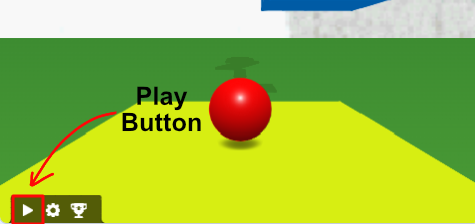

# The Player

So far we have a 3D scene but no way to play it! That's where the player and player controller comes in!

In this section of our platformer tutorial for ChromeEngine, we'll be diving into creating the Player and setting up the camera to follow the player in our 3D world. We'll be focusing on the `Play Logic` block in the `Logic` sprite where our game's core logic resides. 

## Creating the player object

In ChromeEngine, to be able to play your game you need a `Player` object. This is a special type of object that is controlled by the physics engine. The player object is designed to look like a sphere. Forutnately we already setup our player object in the previous section but as a reminder if you want your game to have a `Player` object then you need to add the following anywhere within the `Setup Scene Objects` script.

<ScratchBlocks>
{`
_*obj, _*prim = GameObjects.createPlayer \\( position [0] [1] [0] first person view? <not <>> \\) :: custom
`}
</ScratchBlocks>

## Player Controllers in ChromeEngine

In traditional game engines, you usually have to create your own player controller, which can be a daunting task. However, ChromeEngine takes care of this with a convenient block, `controllers.player_controller`, within the `Play Logic` script (in the `Logic` sprite). This block is responsible for adding full physics-based player movement, camera tracking and controls to your game.

If you're remixing the default blank project then you should already have this block in `Play Logic` but if you don't make sure to add:

<ScratchBlocks>
{`
Controllers.playerController \\( walk speed  [1] jump height [1.6] glide/walk mode = <not <>>\\) :: custom
`}
</ScratchBlocks>

In this block, we've defined the walking speed as `1` and a jump height of `1.6`. The `glide/walk` mode is set to `True`, which means our player character will walk with instant acceleration and constant velocity, which is the standard movement type for first person games.

You can now take control of the character! You'll need to start the game to play it though. By default the game loads in `Play Mode` but if you find for whatever reason that you're not in `Play mode` you can enter it by either pressing the `P` key or clicking the little play button in the bottom left of the stage.

## Adding sound effects when walking

In ChromeEngine we can add sound effects which play when walking by adding 4 sounds to the `logic` sprite which are all named in the format `<sound effect label> <num>`. ChromeEngine comes with a sound effect called 'Concrete Step' which we can add to our game easily with the `materials.set_sfx` block, placed after the material creation somewhere in `Setup scene objects` block in the `Setup` sprite. For example we can add it to the `Yellow` material by doing:

<ScratchBlocks>
{`
materials.setSfx \\(material [Yellow] sound effect label [Concrete Step]\\) :: custom
`}
</ScratchBlocks>

For more info see [here](/docs/user_docs/Materials)

## Wrapping up and Additional Resources

That's all for the "Player" section of our platformer tutorial! But we're not done yet, there's still a lot more to do to make our platformer game more interactive and fun. 

For more detailed information on player and camera logic in ChromeEngine, you can visit [Player and Camera Logic](/docs/user_docs/Controllers) in our documentation.

In the next part of this tutorial, we'll be learn how to make objects move. Keep learning, and happy coding!