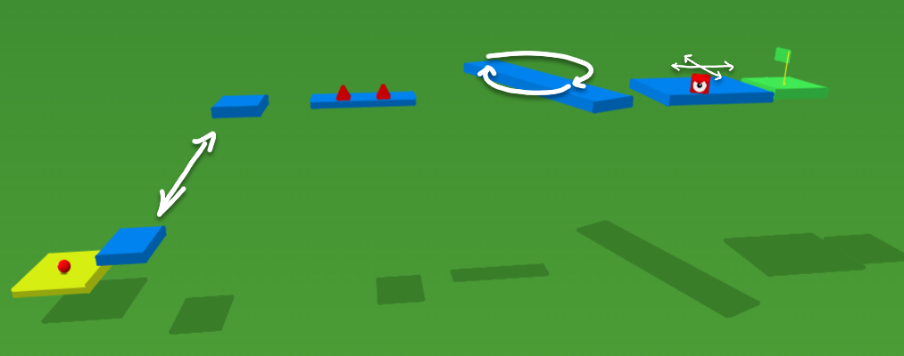

# Moving Objects

Hello, future game designers! We've laid the foundation, now it's time to kick things up a notch and breathe life into our game with moving platforms and hopping enemies! Ready to dive into the dynamic world of ChromeEngine? Let's get to it!

### Mark Dynamic Objects

Before we make anything move we need to tell ChromeEngine, that we want our objects to be "dynamic" otherwise it won't sort them correctly when rendering. We can do this using the `GameObjects.set_dynamic ( )` block. Add the following to the end of the `setup scene objects` block in `Setup`:

<ScratchBlocks>
{`
  GameObjects.setDynamic \\( object name [Enemy] parent object []\\) :: custom
  GameObjects.setDynamic \\( object name [Platform 3] parent object []\\) :: custom
  GameObjects.setDynamic \\( object name [Platform 5] parent object []\\) :: custom
`}
</ScratchBlocks>

It's super important to remember to always start by marking your moving objects as dynamic or things might not behave as expected!

## The 3 logic blocks

In ChromeEngine all game logic should go inside the `Logic` sprite in one `Play Logic`, `Edit Logic` or `Play and Edit Logic`. Each of these serves a different purpose described below:

- **`Play Logic`**: this logic will be called only during play mode, aka when the player is playing the game. You won't see this whilst in edit mode.
- **`Edit Logic`**: this logic will be called only during edit mode, it used for logic which you only want to happen whilst editing the project. You won't need to change this much.
- **`Play and Edit Logic`**: this is for any logic you want to take place in both play mode and edit mode. Most of your logic should go here, as it lets you experience it both whilst editing and playing.

For the rest of this section of the tutorial, assume that any logic blocks are being placed in the `Play and Edit Logic` block. This looks like:

<ScratchBlocks>
{`
  define Play and Edit Logic
`}
</ScratchBlocks>

## Making our platforms move

For `Platform 3`, we're going to make it move. We can do this using the `GameObject.setPosition` block. This block allows us to control where our game objects exist in our 3D game world. The function takes the name of the object we want to manipulate and the x, y, and z coordinates of the new position. 

Here's how we can use it to make `Platform 3` move sway back and forth on both the y and z-axis, aka Diagonally! 

<ScratchBlocks>
{`
  GameObject.setPosition \\( object name [Platform 3] position [0.6] ([3.6] + ([1.8] * ([cos v] of ((timer) * [50])))) ([-5.2] + ([-1.4] * ([sin v] of ((timer) * [50])))) \\):: custom
`}
</ScratchBlocks>

This might look a little complicated but all we're doing is moving the platform along an elliptical path with centre at the original position of `Platform 3` using Sine, Cosine and the timer value.

## Making our platforms spin

For `Platform 5`, we want it to rotate in place around the y-axis (yaw), like a spinning top! We can use the `GameObject.setRotation` block to achieve this effect. This block takes the name of our object and some specific inputs - the yaw, pitch and roll to define the new rotation.

<ScratchBlocks>
{`
  GameObjects.setRotation \\( object name [Platform 5] rotation \\(yaw, pitch, roll\\) (([sin v] of (timer)) * [180])  [] []   \\) :: custom
`}
</ScratchBlocks>

**Pro-tip**: If you leave any of the values empty for the position or rotation, that value won't be set.

If you aren't familiar with yaw, pitch and roll, then just just know that yaw rotates around the y-axis, pitch around the x-axis and roll around the z-axis.

## Moving our enemy towards the player

Our enemy isn't just going to stand there! Lets make our enemy look at the player and then move towards the Player, so that the Player has to react quick or get killed. 

### `pointTowardsPosition` block

To point an object towards a position in ChromeEngine we use the `GameObjects.pointTowardsPosition` block. Here's how we can use it to point the Enemy at the player:

<ScratchBlocks>
{`
  GameObjects.pointTowardsPosition \\( object 1 name [Enemy] Position [@player_x] [] [@player_z]\\) :: custom
`}
</ScratchBlocks>

In ChromeEngine the player position is always stored in the global variables `@player_x`, `@player_y` and `@player_z`. In edit mode the camera position is stored in these variables instead which makes it possible for us to interact with our enemy even in edit mode as if we were the player.

### `move` block
To move an object forward by a step we use the `GameObjects.move` block. Here's how we can use it to make our Enemy move 0.1 steps in what ever direction it's facing each frame:

<ScratchBlocks>
{`
  GameObjects.move \\( object name [Enemy] steps [0.1]\\) :: custom
`}
</ScratchBlocks>

### Restricting the enemy's movement and rotation

If we were to click play now, the enemy would point at us, move directly at us forever. However what we really want is for the Enemy to stay parallel to the `XZ` plane and to stay within the bounds of it's platform.

We can constrain the rotation by setting the pitch rotation to 0 AFTER calling `pointTowardsPosition` and we can bound the position, by only moving the Enemy when the player is within the bounds of the platform! With this our final code for the enemy Logic looks like:

<ScratchBlocks>
{`
    GameObjects.pointTowardsPosition \\( object 1 name [Enemy] Position [@player_x] [] [@player_z]\\) :: custom
    GameObjects.setRotation \\( object name [Enemy] rotation \\(yaw, pitch, roll\\) [] [0] []\\) :: custom
    if <<([abs v] of ((@player_x)-[0]))< [1.4]> and <([abs v] of ((@player_z)-[-20]))< [1.9]>>then
    GameObjects.move \\( object name [Enemy] steps [0.1]\\) :: custom
`}
</ScratchBlocks>

- `0` and `-20` are the x,z coordinate of the platform
- `1.4` and `1.9` are the width, height of the platform

## Wrapping up and Additional Resources

And there you have it! We've successfully set the stage for our platforms to dance and our enemies to attack. Here's what your platformer game should look like now:

For more detailed information on updating objects in ChromeEngine, you can visit [Updating Objects](/docs/user_docs/Updating%20Objects) in our documentation.

Remember, the magic of game development is all about experimentation, so don't be afraid to mix it up and make this game truly your own. Now go ahead, unleash your imagination and let your game objects bust a move!