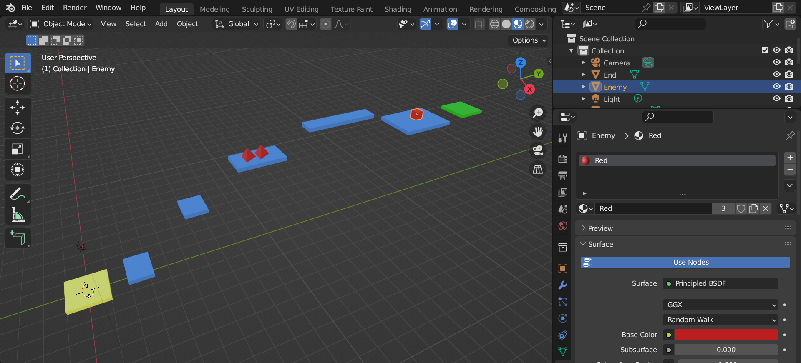
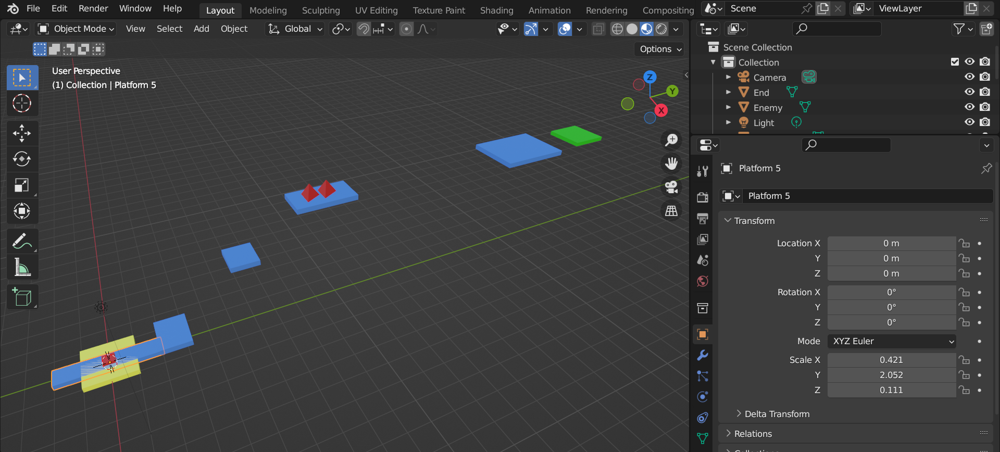

# Modelling with Blender

Whilst the built in tools for creating scene geometry are great, if you want to make bigger scenes it will be easier to make them first in a 3D modelling tool and then import them into the engine. One of the best 3D modelling tools out there is Blender, so here's quick tutorial on how to use it with Chrome Engine

## Modelling your scene

We're not going to cover how you make the scene as there are plenty of [great Blender tutorials](https://www.youtube.com/watch?v=nIoXOplUvAw) out there. We'll assume you have your scene ready to go. Here's an example scene from the [Platformer Tutorial](/docs/tutorials/Platformer%20Tutorial/Intro):

###  Preparing dynamic objects for ChromeEngine

When you import your scene into ChromeEngine the transform origin of each object will always be the origin. This can be problematic, as when we try to transform these objects and their transform center lies at the origin instead of the center of the object, our transformations will be wrong.

To fix this we must reposition our dynamic objects so that their center of rotation is at the origin. We can do this like this:
1. Navigate to the `Object Properties` tab in the `Properties` panel.
2. Write down the current Location value, so that we can reposition back to this location later.
2. Set the Location to 0, 0, 0

Here's what this looks like for the example scene from before:

## Importing and exporting the mesh

### Exporting your mesh

Once you've finished designing your game scene in Blender, export it as an .obj file.

1. Select your objects.
2. Go to `File` -> `Export` -> `Wavefront (.obj)`.
3. In the export settings, make sure to disable exporting normals or UVs. 

### Importing your mesh

Now that you have your beautiful .obj file, let's bring it into your ChromeEngine game. Here's how:

<ScratchBlocks>
{`
GameObjects.import_from_OBJ_file \\( CW orientated? <> scale [1] align_center <> .obj file data \\(leave blank if using _OBJ list\\) []\\) :: custom
`}
</ScratchBlocks>

The `import_from_OBJ_file` function, part of the `GameObjects` class, imports your .obj file into ChromeEngine. The argument `CW orientated? [1]` indicates that your object's faces are oriented clockwise.

To import the file, assign the function to a variable, right-click on `_OBJ`, select `import from file`, and choose the .obj file you exported earlier.

## Importing multiple meshes using `obj file data` input

Importing our .obj file to `_OBJ` and loading it once works fine if you have one single level but often your game will need to have many levels, so how would you do this? Thankfully ChromeEngine has you covered. Instead of importing your .obj file into the _OBJ list simply copy and paste it and put it in the optional `.obj file data` input in the `GameObjects.importFromOBJFile` block!

<ScratchBlocks>
{`
GameObjects.importFromOBJFile \\( CW orientated? <> scale [1] align_center <> .obj file data \\( leave blank if using _OBJ list \\) [Copy and paste your .obj file here, instead of importing it to _OBJ]\\) :: custom
`}
</ScratchBlocks>

## Materials

### Materials and MTL Files

Materials play a crucial role in defining the appearance of 3D objects. They determine their color, texture, and surface properties like shininess. To create materials, we'll be using Blender, a powerful software. We can then export these materials into ChromeEngine scenes using a file format called MTL.

To ensure proper export, remember to use the "Principled BSDF" shader when setting up materials in Blender. Here's a step-by-step guide on exporting an MTL file:

1. Open Blender and create or modify your materials using the "Principled BSDF" shader.
2. Once you're satisfied with your materials, navigate to `File > Export > Wavefront (.obj)`.
3. In the export options panel, make sure to enable the `Write Materials` option, and then proceed with the export.

### Importing an MTL File

Now that you have your MTL file, it's time to import it into ChromeEngine. Follow these steps:

1. Open the MTL file with a text editor of your choice.
2. Copy the material data from the file.
3. Paste the copied data into the `Materials.importFromMtlFile` function within ChromeEngine.

Here's an example of how it should look:

<ScratchBlocks>
{`
Materials.importFromMTL\\(.MTL file data [your file data goes here]\\) :: custom
`}
</ScratchBlocks>

## Blender to ChromeEngine coordinates
Whilst modelling details or setting positions you might want to specify specific coordinates. Unfortunately you can't get the coordinate of vertices yet in ChromeEngine however you can do this in Blender.

1. Enter `Edit Mode` and right click on a vertex
2. press `N` to open properties, and from there you can see the coordinates of the vertex.
    1. Tip: make sure to set to Global!
3. ChromeEngine and Blender use different coordinate systems but you can easily convert them by just swapping the y and z value. And multiplying the new z by negative 1.